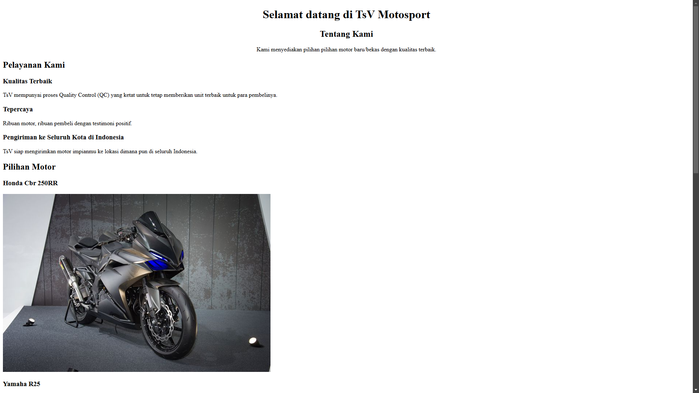

# Motorcycle Sales Web App

Welcome to the TsV Motosport Web App project! This website is designed to facilitate users in purchasing motorcycles with various options, search features, and detailed information about each vehicle.

## Link github pages

    https://botansy.github.io/Revou_m1/

## Key Features

 - **Motorcycle Listings**: Users can view a list of available motorcycles.
 - **Motorcycle Details**: Comprehensive information about specifications and prices of motorcycles.
 - **Contact**: Users can consultation their selected motorcycles before making a purchase.

## Technologies Used

**HTML**: Basic structure of the web pages.

**CSS**: Attractive design and layout.

## Screenshots

## Contributing

We welcome contributions! If you would like to contribute, please create a pull request or report any issues you encounter.

## Contact

If you have any questions or suggestions, feel free to reach out to us via email at 
TsVmotosport@gmail.com

